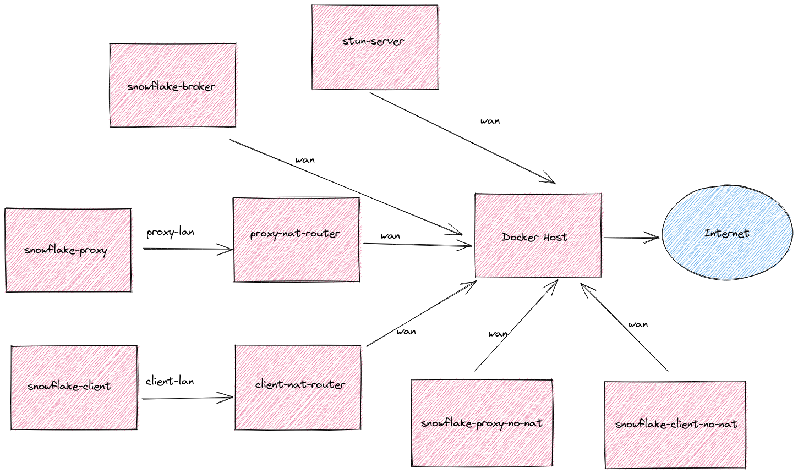

# nat-testing

This is a docker based testbed for evaluating [snowflake](https://gitlab.torproject.org/tpo/anti-censorship/pluggable-transports/snowflake) NAT traversal.

## Concepts
This currently creates 5 services:
- [snowflake-proxy](https://gitlab.torproject.org/tpo/anti-censorship/pluggable-transports/snowflake/-/tree/main/proxy)
- A nat router connecting the snowflake-proxy to the WAN network
- [snowflake-client](https://gitlab.torproject.org/tpo/anti-censorship/pluggable-transports/snowflake/-/tree/main/client)
- A nat router connecting the snowflake-client to the WAN network
- [snowflake-broker](https://gitlab.torproject.org/tpo/anti-censorship/pluggable-transports/snowflake/-/tree/main/broker)

## Topology
 

## Setup
The [.env](./.env) file currently holds all of the configurable values. You _shouldn't_ need to change anything.

## Running
Running all services _should_ (🤞) be as simple as:
```
$ docker-compose up -d
```

To see logs:
```
$ docker-compose logs -f
```

Make a curl command on the client through tor to check connectivity:
```
$ docker-compose exec snowflake-client curl -x socks5h://localhost:9050 https://startpage.com
```

Test nat type:

```
$ docker-compose exec snowflake-client stun-nat-behaviour
$ docker-compose exec snowflake-proxy stun-nat-behaviour
```

Run arbitrary commands on any service you'd like eg:
```
$ docker-compose exec snowflake-client ping 8.8.8.8
$ docker-compose exec snowflake-broker ps aux
$ docker-compose exec proxy-nat-router /bin/sh
```

## Rebuilding
The initial `docker-compose up` will build the relevant images, but subsequent executions will not. If you want to rebuild the container:
```
$ docker-compose --build -d up
```

## Stopping
To stop everything and clear volumes (can be helpful for cleanup):
```
$ docker-compose down --volumes
```

This won't remove networks, so if you'd like to clean them up, you _should_ be able to:
```
$ docker network prune
```

## NOTES:
- With the default `stun-nat-behaviour` command, in order to reach the default stun server (stun.voip.blackberry.com:3478), the services will likely have to travel several NATs. 
That would be due to the "WAN" being simulated. In reality, on a local docker testbed environment, the "WAN" will also be behind some type of NAT, which will affect the NAT that is detected.
In order to effectively evaluate the actual behavior of the NAT re: our WAN, we'll need to run a TUN server attached to the "WAN" interface.

- No snowflake-server/tor relay is included. We're currently depending on the external wss://snowflake.torproject.net/ websocket relay that the snowflake-proxy will connect to.

- The broker is not behind a NAT. I think that's the expected deployment strategy. No fronting is occuring between the proxy/client and the broker.

- I was occasionally getting "address is already taken" errors when trying to bring up certain containers. I'm not 100% sure if that was due to a slightly dirty working state, but the way I was reliably able to fix that was by changing the address for that container's "wan" interface.
